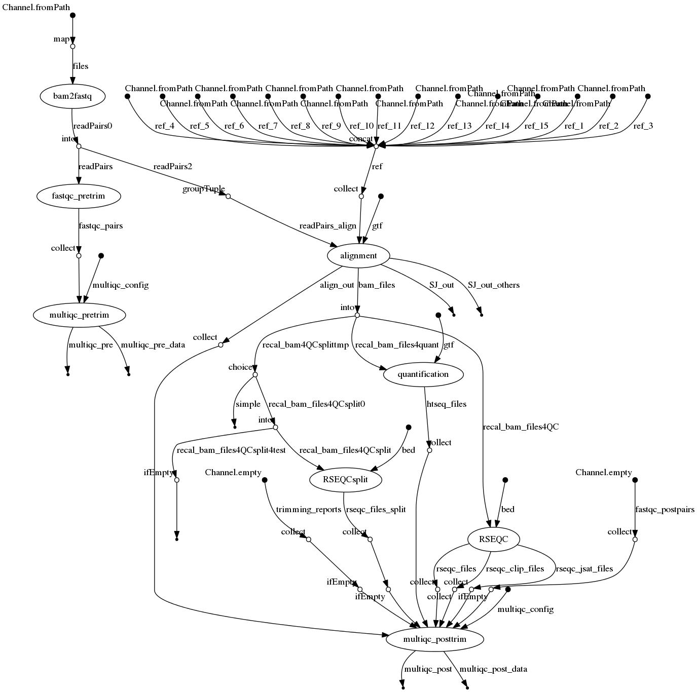
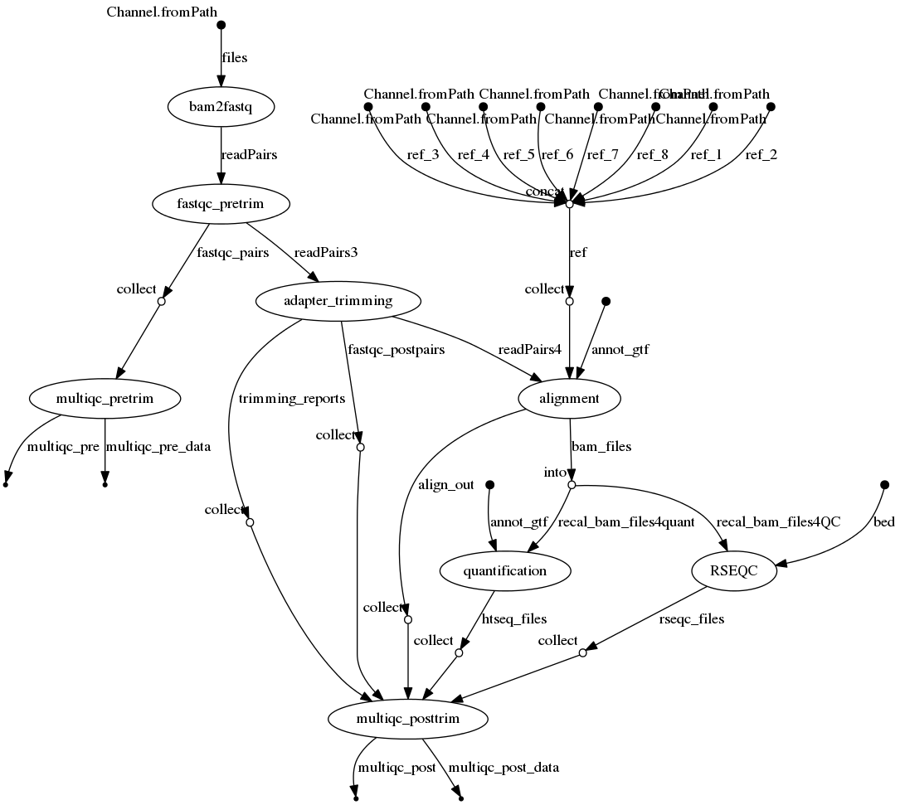
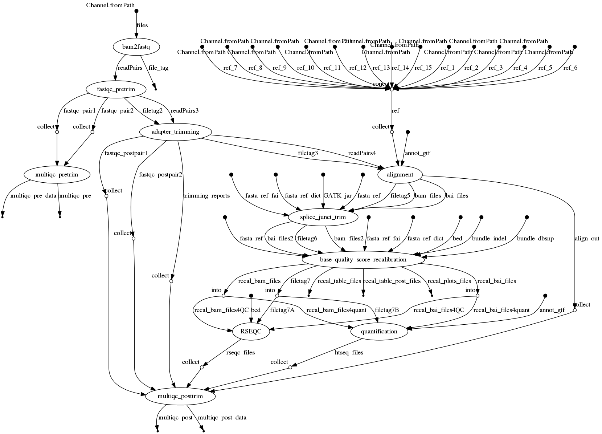

# RNAseq-nf

## Nextflow pipeline for RNA seq processing
[](https://circleci.com/gh/IARCbioinfo/RNAseq-nf/tree/master)
[](https://hub.docker.com/r/iarcbioinfo/rnaseq-nf/)


## Decription

Nextflow pipeline for RNA sequencing mapping, quality control, reads counting, and unsupervised analysis

## Dependencies

1. Nextflow: for common installation procedures see the [IARC-nf](https://github.com/IARCbioinfo/IARC-nf) repository.

2. [*fastqc*](http://www.bioinformatics.babraham.ac.uk/projects/fastqc/INSTALL.txt)
3. [*RESeQC*](http://rseqc.sourceforge.net/)
4. [*multiQC*](http://multiqc.info/docs/)
5. [*STAR*](https://github.com/alexdobin/STAR/blob/master/doc/STARmanual.pdf)
6. [*htseq*](http://www-huber.embl.de/HTSeq/doc/install.html#install); the python script htseq-count must also be in the PATH

**A singularity container is available with all the tools needed to run the pipeline (see "Usage")**

### References
A bundle with reference genome and corresponding annotations for STAR is available at https://data.broadinstitute.org/Trinity/CTAT_RESOURCE_LIB/.

Alternatively, STAR genome indices can be generated from a genome fasta file ref.fa and a splice junction annotation file ref.gtf using the following command:
```bash
STAR --runThreadN n --runMode genomeGenerate --genomeDir ref --genomeFastaFiles ref.fa --sjdbGTFfile ref.gtf --sjdbOverhang 99
```
You can provide a config file to customize the multiqc report (see https://multiqc.info/docs/#configuring-multiqc).

### Reads adapter trimming with cutadapt
In order to perform the optional adapter trimming of reads before mapping the following software must be installed:
- [*cutadapt*](http://cutadapt.readthedocs.io/en/stable/installation.html) version > 1.15, which requires Python version > 2.7
- [*trim_galore*](https://github.com/FelixKrueger/TrimGalore)

### Alignment with hisat2
In order to perform the optional alignment with hisat2, hisat2 must be installed:
- [*hisat2*](https://ccb.jhu.edu/software/hisat2/index.shtml)

In addition, indexes files *.ht2* must be downloaded from generated from [*hisat2*](https://ccb.jhu.edu/software/hisat2/index.shtml), or generated from a reference fasta file (e.g., reference.fa) and a GTF annotation file (e.g., reference.gtf) using the following commands:
```bash
extract_splice_sites.py reference.gtf > genome.ss
extract_exons.py reference.gtf > genome.exon
hisat2-build reference.fa --ss genome.ss --exon genome.exon genome_tran
```

### Reads trimming at splice junctions
In order to perform the optional reads trimming at splice junctions, GATK4 must be installed:
- [*GATK*](https://software.broadinstitute.org/gatk/guide/quickstart)

In addition, index *.fai* and dictionnary *.dict* must be generated from the fasta reference genome using the following commands:
```bash
samtools faidx ref.fa
java -jar picard.jar CreateSequenceDictionary R= ref.fa O= ref.dict
```

### Base quality score recalibration
In order to perform the optional base quality score recalibration, several files are required:
- [*GATK4*](https://software.broadinstitute.org/gatk/guide/quickstart) must be in the PATH variable
- [GATK bundle](https://software.broadinstitute.org/gatk/download/bundle) VCF files with lists of indels and SNVs (recommended: 1000 genomes indels, dbsnp VCF)
- bed file with intervals to be considered

## Input 
 | Type      | Description     |
  |-----------|---------------|
  |--input_folder    | a folder with fastq files or bam files |
  |--input_file |  input tabulation-separated values file with columns SM (sample name), RG (read group), pair1 (first fastq pair file), and pair2 (second fastq pair file) |
  
  Note that there are two input methods: folder and file. Although the input folder method is the easiest because it does not require to create an input file with the right format, the input file mode is recommended in cases when a single sample has multiple paired files (e.g., due to multiplexed sequencing); in that case, users should have one line per pair of file and put a same SM identifier so that the workflow can group them into the same output bam file.


## Parameters

* #### Mandatory
| Name | Example value | Description |
|-----------|--------------:|-------------| 
|--ref_folder | ref | reference genome folder |
|--gtf   |  Homo_sapiens.GRCh38.79.gtf | annotation GTF file |
|--bed   |  gene.bed | bed file with genes for RESeQC | 


* #### Optional

| Name | Default value | Description |
|-----------|--------------|-------------| 
|--cpu          | 4 | number of CPUs |
|--cpu_gatk     | 1 | number of CPUs for GATK processes (SJ trimming and BQSR) |
|--cpu_trim     | 15 | number of CPUs for reads trimming (cutadapt) |
|--mem         | 50 | memory for mapping|
|--mem_QC     | 2 | memory for QC and counting|
|--fastq_ext    | fq.gz | extension of fastq files|
|--suffix1      | \_1 | suffix for second element of read files pair|
|--suffix2      | \_2 | suffix for second element of read files pair|
|--output_folder   | . | output folder for aligned BAMs|
|--ref |    ref.fa | reference genome fasta file for GATK |
|--snp_vcf |  dbsnp.vcf | VCF file with known variants for GATK BQSR |
|--indel_vcf |  Mills_100G_indels.vcf | VCF file with known indels for GATK BQSR |
|--STAR_mapqUnique | 255  | STAR default mapping quality for unique mappers |
|--RG          |  PL:ILLUMINA | string to be added to read group information in BAM file |
|--stranded   |  no | Strand information for counting with htseq [no, yes, reverse] | 
|--hisat2_idx   |  genome_tran | index filename prefix for hisat2 | 
|--htseq_maxreads | 30000000 | Maximum number of reads taken into account by htseq-count |
|--multiqc_config   |  null | config yaml file for multiqc | 


* #### Flags

| Name  | Description |
|-----------|-------------| 
|--help | print usage and optional parameters |
|--cutadapt | enable adapter and quality reads trimming before alignment|
|--sjtrim   | enable reads trimming at splice junctions | 
|--hisat2   | use hisat2 instead of STAR for mapping | 
|--recalibration  | perform quality score recalibration (GATK)|


## Usage
To run the pipeline on a series of paired-end fastq files (with suffixes *_1* and *_2*) in folder *fastq*, a reference genome with indexes in folder *ref_genome*, an annotation file ref.gtf, and a bed file ref.bed, one can type:
```bash
nextflow run iarcbioinfo/RNAseq-nf -r v2.2 -profile singularity --input_folder fastq --ref_folder ref_genome --gtf ref.gtf --bed ref.bed
``` 
To run the pipeline without singularity just remove "-profile singularity"

### Use hisat2 for mapping
To use hisat2 instead of STAR for the reads mapping, you must add the ***--hisat2* option**, specify the path to the folder containing the hisat2 index files (genome_tran.1.ht2 to genome_tran.8.ht2), as well as satisfy the requirements above mentionned. For example:
```bash
nextflow run iarcbioinfo/RNAseq-nf --input_folder fastq --ref_folder ref_genome --gtf ref.gtf --bed ref.bed --hisat2 --hisat2_idx genome_tran 
```
Note that parameter '--hisat2_idx' is the prefix of the index files, not the entire path to .ht2 files. 

### Enable reads trimming at splice junctions
To use the reads trimming at splice junctions step, you must add the ***--sjtrim* option** as well as satisfy the requirements above mentionned. For example:
```bash
nextflow run iarcbioinfo/RNAseq-nf --input_folder fastq --ref_folder ref_genome --gtf ref.gtf --bed ref.bed --sjtrim
```

### Enable Base Quality Score Recalibration
To use the base quality score recalibration step, you must add the ***--recalibration* option**, specify the path to the known snps and indels from the GATK bundle, as well as satisfy the requirements above mentionned. For example:
```bash
nextflow run iarcbioinfo/RNAseq-nf --input_folder fastq --ref_folder ref_genome --gtf ref.gtf --bed ref.bed --recalibration --snp_vcf GATK_bundle/dbsnp_146.hg38.vcf.gz --indel_vcf GATK_bundle/Mills_and_1000G_gold_standard.indels.hg38.vcf.gz
```

## Output 
  | Type      | Description     |
  |-----------|---------------|
  | BAM/file.bam    | BAM files of alignments or realignments |
  | BAM/file.bam.bai    | BAI files of alignments or realignments |
  | BAM/STAR.file.Chimeric.SJ.out.junction | STAR chimeric junction output |
  | BAM/STAR.file.SJ.out.tab | STAR junction tab output |
  | counts/file_count.txt                   | htseq-count output file  |
  | QC/multiqc_pretrim_report.html  | multiqc report before trimming | 
  | QC/multiqc_pretrim_report_data            | folder with data used to compute multiqc report before trimming |
  | QC/multiqc_posttrim_report.html      |     multiqc report before trimming | 
  | QC/multiqc_posttrim_report_data      |  folder with data used to compute multiqc report before trimming |
  | QC/adapter_trimming/file_{12}.fq.gz_trimming_report.txt | trim_galore report | 
  | QC/adapter_trimming/file_{12}_val_{12}_fastqc.zip | FastQC report after trimming | 
  | QC/alignment/STAR.file.Log.final.out, STAR.file.Log.out, STAR.file.Log.progress.out | STAR logs |
  | QC/bam/file_readdist.txt, file_clipping_profile\*, file_jun_stauration\*| RSeQC reports |
  | QC/fastq/file_{12}_pretrim_fastqc.zip | FastQC report before trimming | 
  | QC/BAM/BQSR/file_recal.table | table of scores before recalibration   |
  | QC/BAM/BQSR/file_post_recal.table   | table of scores after recalibration |
  | QC/BAM/BQSR/file_recalibration_plots.pdf   |  before/after recalibration plots   |
          
The output_folder directory contains three subfolders: BAM, counts, and QC

## Directed Acyclic Graph

### With default options
[](http://htmlpreview.github.io/?https://github.com/IARCbioinfo/RNAseq-nf/blob/dev/dag_STAR.html)

### With option --hisat2
[](http://htmlpreview.github.io/?https://github.com/IARCbioinfo/RNAseq-nf/blob/dev/dag_hisat2.html)

### With options --sjtrim and --recalibration
[](http://htmlpreview.github.io/?https://github.com/IARCbioinfo/RNAseq-nf/blob/dev/dag_STAR_sjtrim_recal.html)

## Contributions

  | Name      | Email | Description     |
  |-----------|---------------|-----------------| 
  | Nicolas Alcala*    | AlcalaN@fellows.iarc.fr    | Developer to contact for support |
  | Noemie Leblay | LeblayN@students.iarc.fr | Tester |
  | Alexis Robitaille | RobitailleA@students.iarc.fr | Tester |
  

